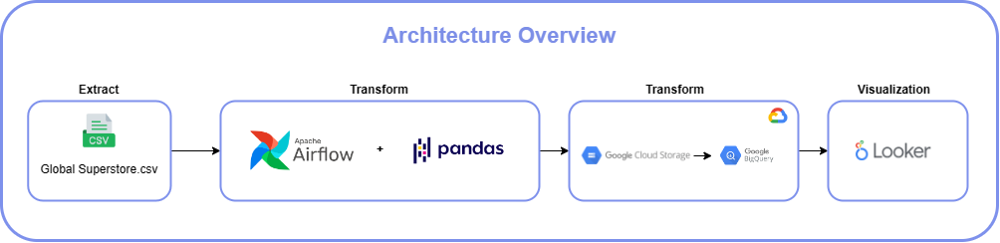
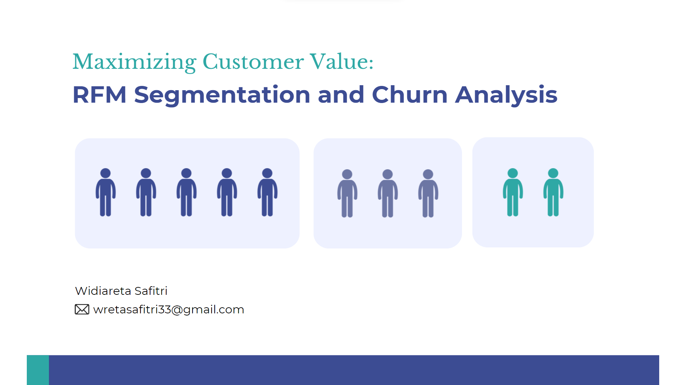

# Data Scientist
1. **Technical Skill: Python, MySQL, Tableau, Google Studio, Google Cloud, Airflow, Excel**
2. **Soft Skill: Critical Thinking, Presentation, Data Storytelling**

## Education
- **D4 Informatics Engineering** : Politeknik Negeri Malang

## Professional Experience
### Data Engineering at IYKRA  
 July 2023 - August 2023

- Design an architecture pipeline (batch processing) to integrate data into a data warehouse using
Apache Airflow, Apache Spark, and Apache Kafka.
- Perform the ETL (Extract, Transform, Load) process for data processing and loading stages.
- Develop a dashboard visualization specifically for Fault Detection in Online Transactions using
Looker Studio and BigQuery.

### IT Support Intern at Opero Hotel Southkey  
 January 2023 - February 2023

- Responsible for ensuring the seamless operation of Guest Internet, Property Management Systems,
Point of Sales, Opera, Telephony systems, and other software providers.
- Responds courteously and effectively to visitor's and system user's questions and difficulties.
- Generate weekly and daily reports to track telephone and printer usage across various departments

## Project
### Fraud Detection for Online Transaction
**Tools: Apache Airflow, DBT, Google Looker, Python, Docker, Spark, Google Storage, Google BigQuery**

A Digital Wallet company has quite a large amount of online transaction data. The company wants to acknowledging data limitation and uncertainties such as inaccurate or missing crucial information data. On the other hand, the company also wants to use online transaction data to detect online payment fraud that harms their business. The goal of this project is to Create a data pipeline that can be utilised for analysis and reporting to determine whether online transaction data has excellent data quality and can be used to detect fraud in online transactions.

[Presentation](https://drive.google.com/file/d/1Du-qdJ4TgBvl1wrcb0-DgKF5pO9ma3Kw/view) | [Github](https://github.com/widiarsaf/final-project-fraud-transaction-pipeline) |   [Dashboard](https://lookerstudio.google.com/reporting/eef88548-5ad4-4b22-82c4-37b7bb29ce0e) 

### Simple Orchestrate ETL with Apache Airflow
Simple Orchestrate ETL with Apache Airflow project is an overview of a simple Extract, Transform, Load (ETL) process using Airflow, Google Cloud Storage, and BigQuery. At the end of the project, visualization is performed using Looker Studio, where data is gained from the data that has already been ingested into BigQuery.The architecture for ETL begins with extracting data from the data source, which is then transformed using pandas, with orchestration processes managed using Airflow. After the transformation, the data will be ingested into Google Storage, and subsequently sent to Google BigQuery. After that, a visualization process is carried out using Looker Studio

[Github](https://github.com/widiarsaf/simple-orchestrate-etl-airflow-globalSuperstore/tree/master) | [Dashboard](https://lookerstudio.google.com/reporting/0fcb01e5-3767-416c-9f3d-ec8b2963969e/page/xtQdD) 

### Customer Segmentation and Churn Analysis
The architecture for ETL begins with extracting data from the data source, which is then transformed using pandas, with orchestration processes managed using Airflow. After the transformation, the data will be ingested into Google Storage, and subsequently sent to Google BigQuery. After that, a visualization process is carried out using Looker Studio.

[Presentation](https://www.canva.com/design/DAFuNsddcUk/iy32ebVAK-t9zDV_l9GnWw/view?utm_content=DAFuNsddcUk&utm_campaign=designshare&utm_medium=link&utm_source=publishsharelink) | [Github](https://github.com/widiarsaf/customer_segmentation_and_churn_analysis) 
